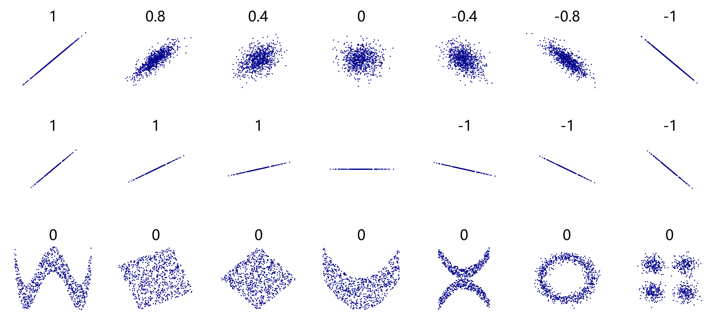
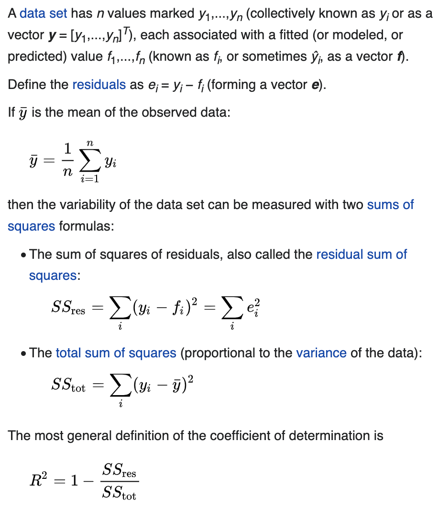
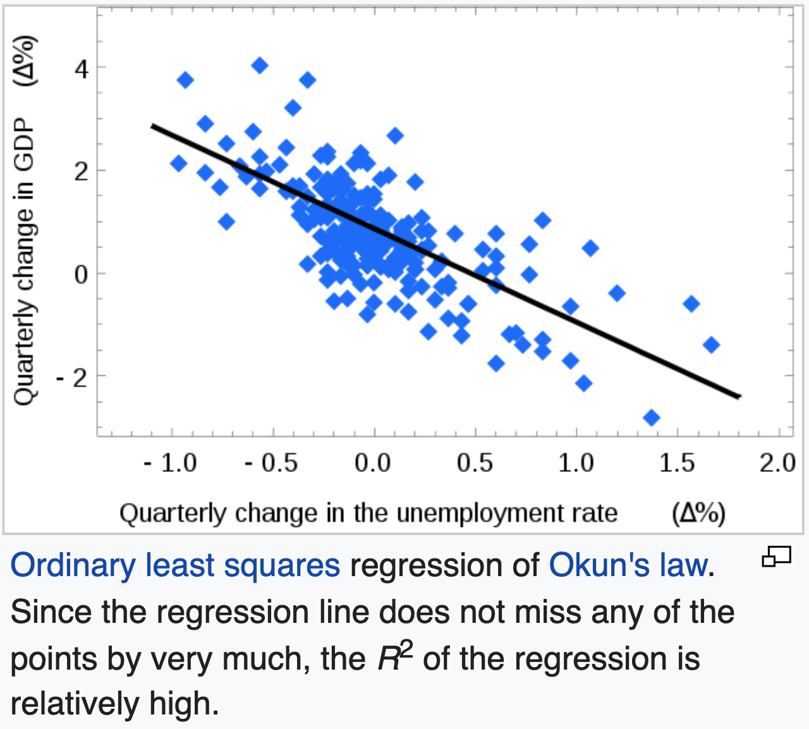
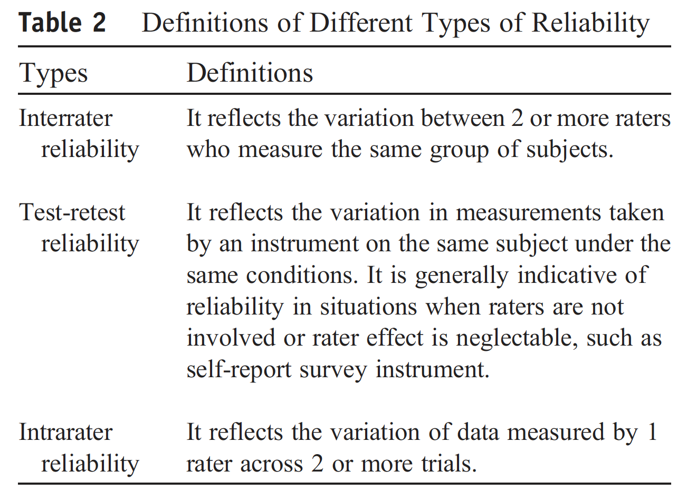
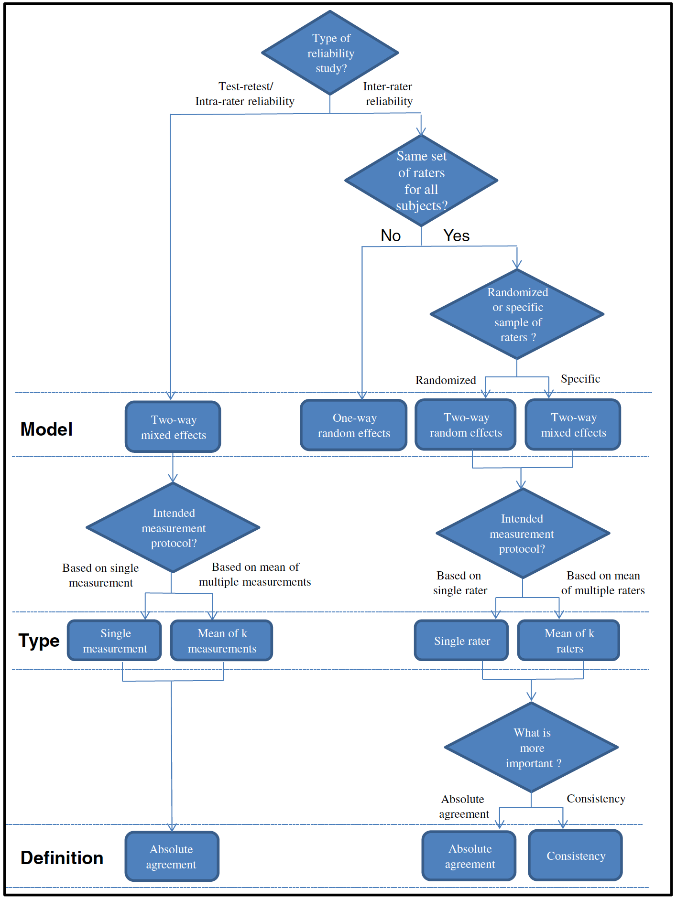
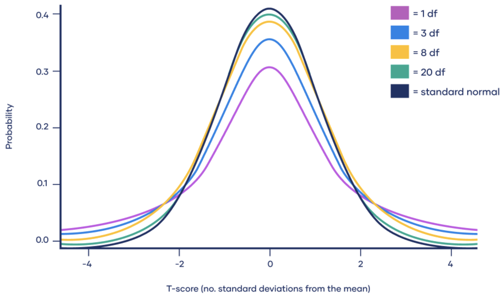
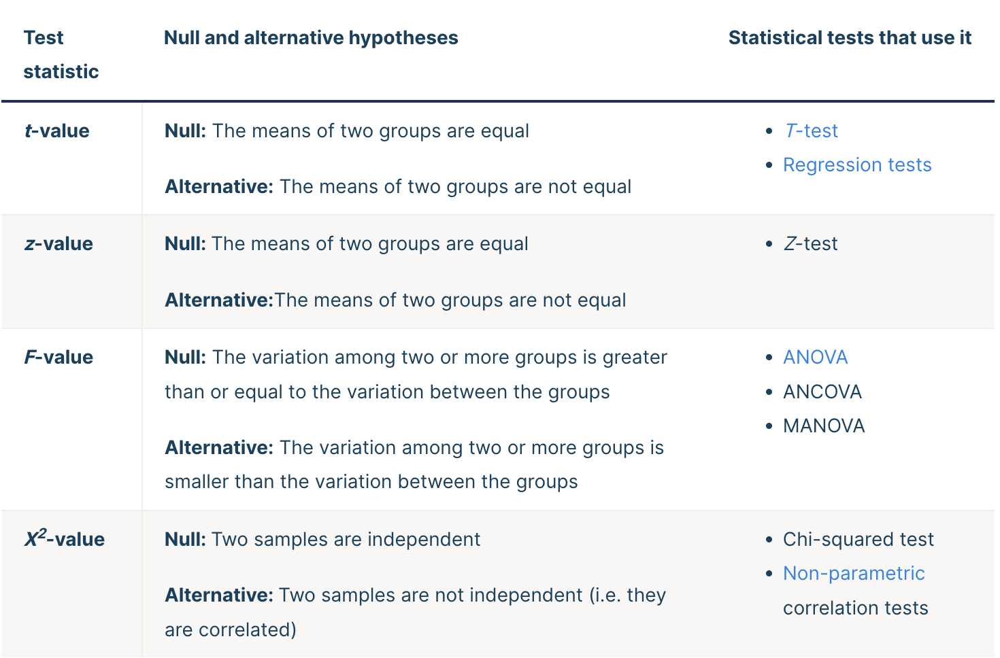
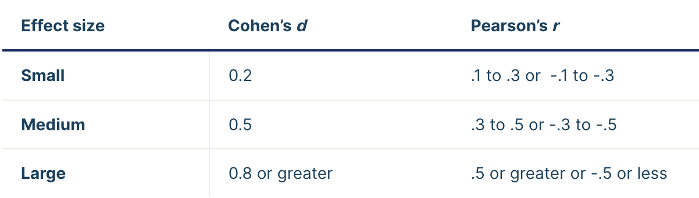
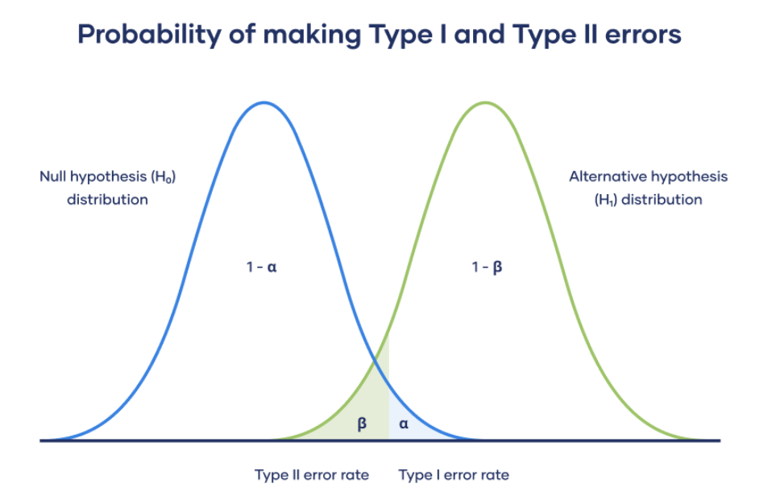
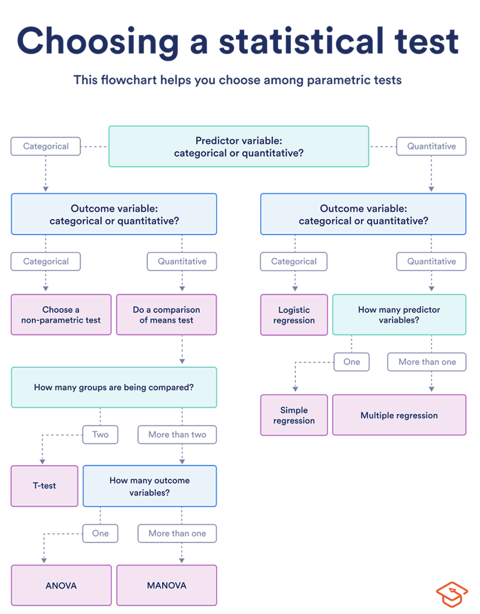

# StatisticsAtGlance

1. #### Pearson’s correlation coefficient (PCC), aka Pearson's r and bivariate correlation, or simply as correlation coefficient.
   
   - A ratio between the covariance of two variables and the product of their standard deviations, thus it is essentially a normalized measurement of the covariance, [-1,1].
   
   - A measure of linear correlation between two sets of data.
   
   
   
   
   
   ---

2. #### Coefficient of determination, $R^2$ (R squared)
   
   - Proportion of the variation in the dependent variable that is **predictable** from the independent variable(s). Normally within the range of 0 to 1.
   
   - In cases where negative values arise, the mean of the data provides a better fit to the outcomes than do the fitted function values, according to this particular criterion.
   
   - It provides a measure of how well observed outcomes are replicated by the model, based on the proportion of total variation of outcomes explained by the model.
     
     
     
     
   
   ---

3. #### Intraclass Correlation Coefficient, ICC
   
   - A reliability index in test-retest, intra-rater, inter-rater reliability analyses. 
     
     | ICC value | Reliability |
     |:---------:|:-----------:|
     | <0.5      | Poor        |
     | 0.5-0.75  | Moderate    |
     | 0.75-0.9  | Good        |
     | >0.9      | Excellent   |
     
     
   
   - Different forms of ICC involve distinct assumptions, leading to different interpretations. Each form has the attributes of **Model**, **Type**, and **Definition**.
     
     
   
   - Absolute agreement concerns if different raters assign the same score to the same subject. Conversely, consistency definition concerns if raters’ scores to the same group of subjects are correlated in an additive manner.
   
   - As a rule of thumb, researchers should try to obtain at least **30 heterogeneous samples** and involve at least **3 raters** whenever possible when conducting a reliability study.
   
   - Example of 95% confidence interval: 95% confidence interval ranges between 0.879 and 0.965 mean that there is 95% chance that the true ICC value lands on any point between 0.879 and 0.965.
   
   ---

4. #### Descriptive statistics & Inferential statistics
   
   - In quantitative research, after collecting data, the first step of statistical analysis is to describe characteristics of the responses, such as the average of one variable (*e.g.*, age), or the relation between two variables (*e.g.*, age and creativity), namely **descriptive statistics**.
     
     - **Frequency distribution**, the frequency of each value.
     
     - **Central tendency**, the center or average of the dataset, namely Mean, Median (the middle value), Mode (the most frequent value).
     
     - **Variability**, give you a sense of how spread out the response values are, namely Range, Variance, Standard Deviation.
   
   - The second step is to decide whether your data confirms or refutes your hypothesis and whether it is generalizable to a larger population, namely **inferential statistics**.
   
   ---

5. #### Central Limit Theorem
   
   - A sampling distribution of the mean is the distribution of the means of these different samples.
     
     - Law of Large Numbers: As you increase sample size (or the number of samples), then the sample mean will approach the population mean.
     
     - With multiple large samples, the sampling distribution of the mean is normally distributed, even if your original variable is not normally distributed.
   
   ---

6. #### t-distribution
   
   - A type of normal distribution used for smaller sample sizes, where the variance in the data is unknown, with the greatest number of **observations** close to the mean and fewer observations in the tails.
   
   - t-distribution is mostly used to either find corresponding p-value from a statistical test (**t-test**), or find the critical values for a  confidence interval.
   
   - The variance in a t-distribution is estimated based on the **degrees of freedom** of the data set (total number of observations minus 1). Above 30 degrees of freedom, the t-distribution roughly matches the z-distribution. 
     
     
   
   - Given the t-value, namely the number of standard deviation from the mean of the distribution, one can acquire the lower and upper bound of a confidence interval, or acquire the p-value according to the t-table.
   
   ---

7. #### Confidence interval
   
   - The mean of your estimate plus and minus the variation in that estimate. This is the range of values you expect your estimate to fall between if you redo your test, within a certain level of confidence.
   
   - The confidence level is the percentage of times you expect to reproduce an estimate between the upper and lower bounds of the confidence interval, and is set by the **alpha value** $\alpha$ (the threshold for statistical significance, namely **significance level**). 
     
     - Confidence level $= 1-\alpha$. So if you use an alpha value of p < 0.05 for statistical significance, then your confidence level would be 1 − 0.05 = 0.95, or 95%.
     
     - For example, if you construct a confidence interval with a 95% confidence level, you are confident that 95 out of 100 times the estimate will fall between the upper and lower values specified by the confidence interval.
   
   ---

8. #### Hypothesis testing
   
   - Step 1, State your null and alternate hypothesis.
     
     - Initial research hypothesis (Alternative hypothesis $H_a$) $\rightarrow$ Null hypothesis $H_o$.
   
   - Step 2, Collect data.
   
   - Step 3, Statistical test.
   
   - Step 4, Reject or accept the null hypothesis.
     
     - Normally we have $\alpha=0.05$, and some may reduce it to 0.01, to reduce the risk of rejecting the null hypothesis by mistake (**Type I error**). $\alpha$ is also called the probability of making type I error. 
   
   - Step 5, Present the findings.
   
   ---

9. #### Test statistics
   
   
   
   - The agreement between your calculated test statistic and the predicted values is described by the **p-value**. The smaller the p-value, the less likely your test statistic is to have occurred under the null hypothesis of the statistical test.
- Because the test statistic is generated from your observed data, this ultimately means that the smaller the **p-value**, the less likely it is that your data could have occurred if the null hypothesis was true.
  
   ---
10. #### $p$ value, probability value
    
    - A number calculated from a statistical test that describes how likely you are to have found a particular set of observations if the **null hypothesis** were true. The smaller the p-value, the more likely you are to reject the null hypothesis.
      
      - If your p-value is 0.05, that means that 5% of the time you would see a test statistic at least as extreme as the one you found if the null hypothesis was true.
      
      - **Statistical significance** is another way of saying that the p-value of a statistical test is small enough to reject the null hypothesis of the test.
      
      - The p-value can only tell you whether or not the null hypothesis is supported. It cannot tell you whether your **alternative hypothesis** is true, or why.
    
    - Tables for calculating the p-value are made based on the **test statistic** and **degrees of freedom** (number of observations minus number of independent variables) of your test. 
    
    ---

11. #### Statistical power, sensitivity
    
    - High power in a study indicates a large chance of a test detecting a **true effect**. Low power means that your test only has a small chance of detecting a true effect or that the results are likely to be distorted by random and systematic error.
    
    - Power is mainly influenced by sample size, measurement error (random and systematic errors), **effect size**, and **significance level** (alpha value $\alpha$).
      
      - effect size can be Cohen's d or Pearson's r.
        
        
    
    ---

12. ###### Error
    
    - Type I error $\rightarrow$ refuting the null hypothesis but it is true $\rightarrow$ error rate = **significance level** $\alpha$.
      
      - When conducting multiple analyses on the same dependent variable, the chance of committing a Type I error increases, thus increasing the likelihood of coming about a significant result by pure chance. To correct for this, or protect from Type I error, a **Bonferroni correction** is conducted, setting the original $\alpha$ to be $\alpha/n$, with $n$ being the number of independent hypothesis.
    
    - Type II error $\rightarrow$ not refuting the null hypothesis but it is false $\rightarrow$ error rate $\beta$=1-**statistical power**. One of the simplest methods to increase the power of the test is to increase the sample size used in a test.
    
    - The trade off between Type I and Type II errors.
      
      - The significance level \alpha (the Type I error rate) affects statistical power, which is inversely related to the Type II error rate.
        
        
    
    ---

13. #### Statistical test
    
    - Types of variable (for both predictor and outcome variables), number of groups being compared lead to different tests.
    
    
    
    - If your data do not meet the assumption of **independence** of observations, you may be able to use a test that accounts for structure in your data (**repeated-measures tests** or tests that include blocking variables).
    
    ---

14. #### T-test
    
    - Types of t-test
      
      - If the groups come from a single population (e.g. measuring before and after an experimental treatment), perform a **paired t-test**.
      
      - If the groups come from two different populations (e.g. two different species, or people from two separate cities), perform a **two-sample t-test** (a.k.a. **independent t-test**).
      
      - If there is one group being compared against a standard value (e.g. comparing the acidity of a liquid to a neutral pH of 7), perform a              **one-sample t-test**.
      
      - Only consider difference $\rightarrow$ **two-tailed t-test**. Consider the comparison $\rightarrow$ **one-tailed t-test**.
    
    - Report t-test with: t(**df**)=**t-value,** **p-value**
    
    ---

15. #### Anova (Analysis of Variance)
    
    - Independent vs. dependent variables
      
      - You manipulate the independent variable (the one you think might be the cause) and then measure the dependent variable (the one you think might be the effect) to find out what this effect might be.
      
      - As a crop researcher, you want to test the effect of three different fertilizer mixtures (types of fertilizer mixtures as the **independent variable**) on crop yield (**dependent variable**).
      
      - Independent variable can have different **groups** or **levels**.
    
    - A **one-way** ANOVA uses one independent variable.
      
      - Report one-way ANOVA with f(**df**)=**f-value**, **p-value**. The larger the F value, the more likely it is that the variation associated with the independent variable is real and not due to chance.
      
      - **Repeated measures** ANOVA is the equivalent of the one-way ANOVA, but for related, not independent groups, and is the extension of the **paired t-test**. Report repeated measures ANOVA with f(**df_between_groups**, **df_within_groups**)=**f-value**, **p-value**
    
    - A **two-way** ANOVA uses two independent variables. Report two-way ANOVA in a similar way as one-way ANOVA but for each independent variable.

References mainly taken from
- Wikipedia
- https://www.scribbr.com/category/statistics/
- Koo, Terry K., and Mae Y. Li. "A guideline of selecting and reporting intraclass correlation coefficients for reliability research." Journal of chiropractic medicine 15, no. 2 (2016): 155-163.

